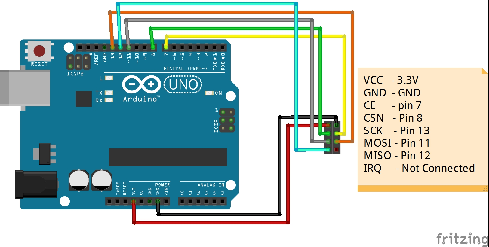
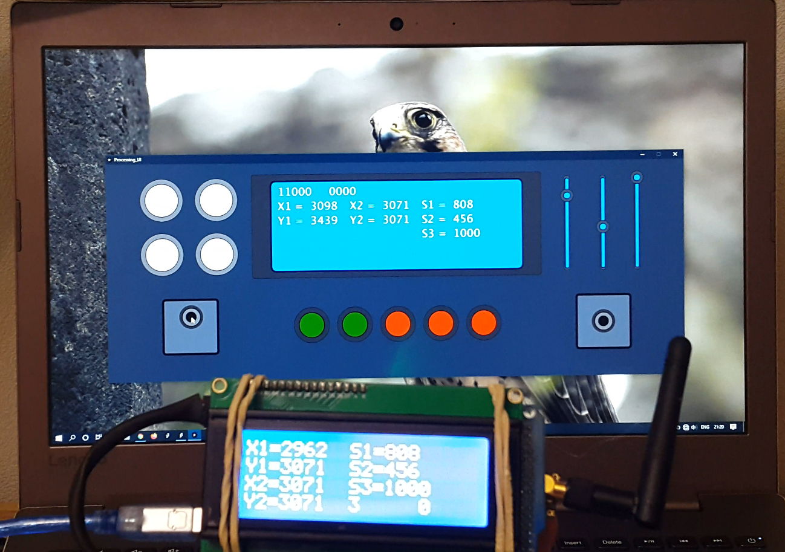

# Arduino-Processing-Based-Radio-Controller

This is a SLC (Super-Low-Cost) Radio-Transmitter with the use of Both Arduino &amp; Processing 3, that can be used for DRONES and RC everything basically!

## **Code Contains of 2 Major Parts**

- **Arduino** (This part itself contains 2 parts)
    - ***Ground Control***
        > This is the Ground Staion that talks to the Computer from Serial Port and Sends Data into the reciever with the NRF24L01 module. The Hardware only contains of a arduino (UNO in my case(ofcourse any arduino can be used...)) and a NRF24L01+ module. With the CE connected to pin #7 of arduino, and CSN into 8. Schematic and the actual thing is shown below. I just putted into a case for beauty purposes!

    - ***Major Tom***
        > This is the main Receiver that Can be connected into any device. but for the test purposes I've conneced a I2C-LCD into it. Surely the Code can be modified for the use.

- **UI made with Processing3**
    > This is the part that Starts the UI in the Computer and Lets you Produce Control Commands. It then sends it into the Ground Control Using Serial-Communication-Protocol.
    
    > Also all the Produced Input Values (Joysticks, the Buttons and the Sliders) show up in an artificial Monitor, shown in the middle of the interface. 

    > The portable desktop app is also available in the "App" directory for Linux. But consider that the Serial port to the Arduino should be changed into custom, if it is not the first.

# ***Real Radio***
> This is the hard-made version of the same Radio...

# ***Final SLC Radio***
> Final Version of the Low-Cost-Radio

> This is the custom made UI and the test LCD! Tried to make it as similar looking to the real one as possible!

